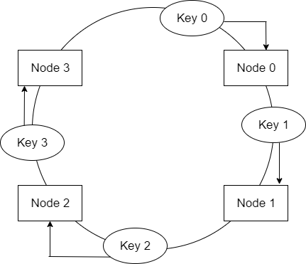
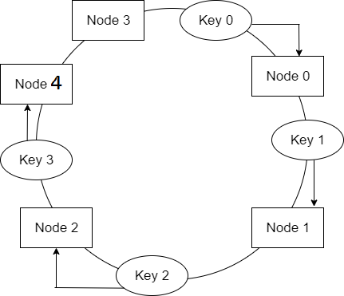
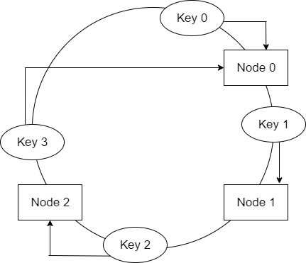

# conhash
Scalable Distributed System using Consistent Hashing

## Description

The program implements consistent hashing in the following manner:
1.  The server has a pre-defined set of keys and their corresponding hashes.
2.  Whenever a node connects to the server, the server has to allocate keys to the client. The server does this using the principle of consistent hashing. 
3.  Whenever a node disconnects from the server, the server reallocates its key to another node. This operation is governed by the principle of consistent hashing.

Due to consistent hashing, the addition and deletion of nodes actually result in only 0.01% remapping of keys. Whereas if we go by traditional hashing, 99% keys have to be remapped.

## Consistent Hashing

Consider a system where we have n nodes and we have to distribute a set of keys across them. Traditional hashing does this as follows:
1.  Calculate hash(key)%n.
2.  Allocate the key to the node corresponding to this value.
3.  Repeat for all keys.

Thus, in traditional hashing, the mapping of keys depends on the size of the nodes(n). If n changes, the distribution of keys across the nodes would also change. This redistribution would result in 99% of the keys being moved from one node to another. If the size of the nodes changes frequently, then this approach is not suitable.

Consistent hashing is a solution to this problem. If a node is added or removed, then only 0.01% of keys need to be remapped. Consistent hashing works as follows:
1.  A hash ring is created.
2.  The hash values of keys are calculated.
3.  These hash values are mapped on the hash ring.
4.  Hash values of the nodes are calculated and they are mapped on the ring.
5.  The keys need to be allocated to the nodes. There can be two cases:

     1. The hash value maps to a place on the ring which does not have a node. In this case, we travel clockwise on the ring from the           point where the key mapped to, until we find the first node. Once we find the first node travelling clockwise on the ring, we           insert the key there. The same logic would apply while trying to find a key in the ring.

      2. The hash value of the key maps directly onto the same hash value of a node – in which case we place it on that server.

 6.  Addition of a node:
 
     If we add another node to the hash ring, node 4, we'll need to remap the keys. However, only the keys that reside between node 3        and node 0, need to be remapped to node 4. On average, we'll need to remap only k/n keys, where k is the number of keys and n is        the number of nodes. This is in sharp contrast to our traditional approach where we needed to remap nearly all the keys.

 7. Deletion of a node:
 
    As we can see in the figure below, if node 0 goes down, only the keys in between node 3 and node 0 will need to be remapped to node     1. The rest of the keys are unaffected.

